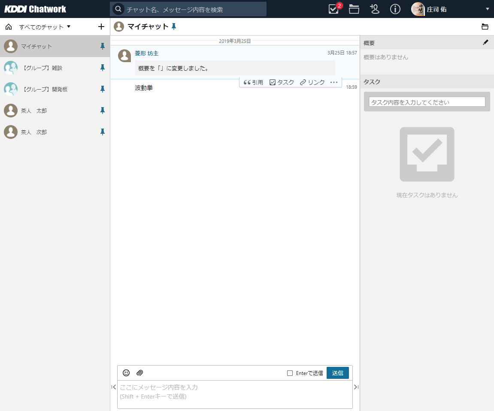
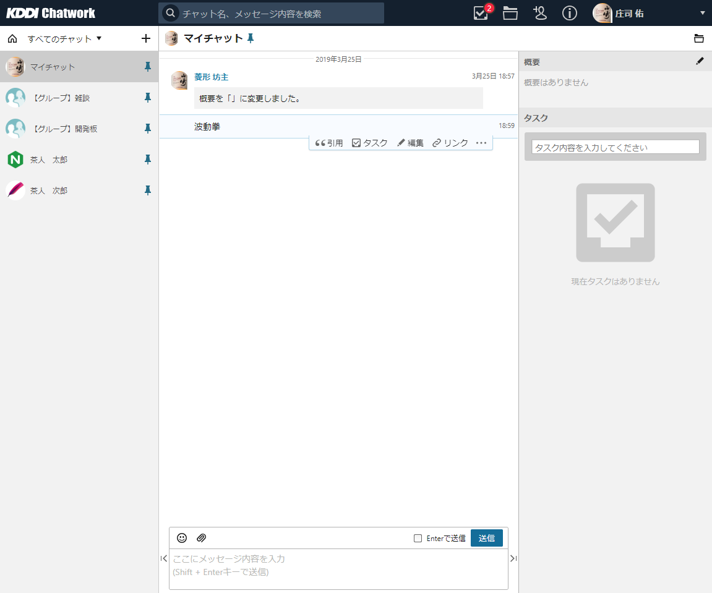
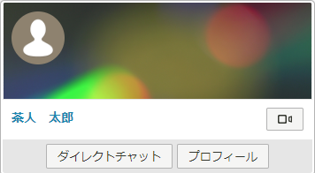

# チャットワーク アイコン クリーナー



## 想い

平穏なチャットワークライフを。


## 機能



* Chatworkで各人が設定しているアイコンやカバー画像を、デフォルトにします。
* Chatwork、KDDI Chatworkに対応。



## 使用イメージ

### メイン画面

* After

* Before


### コンタクトパネル（After）



## 付録

ON/OFF機能はないので、「<a href="https://chrome.google.com/webstore/detail/extensity/jjmflmamggggndanpgfnpelongoepncg">Extensity</a>」などお使いください。




## 更新履歴
* 2019/03/25 0.1.0 初期バージョン


